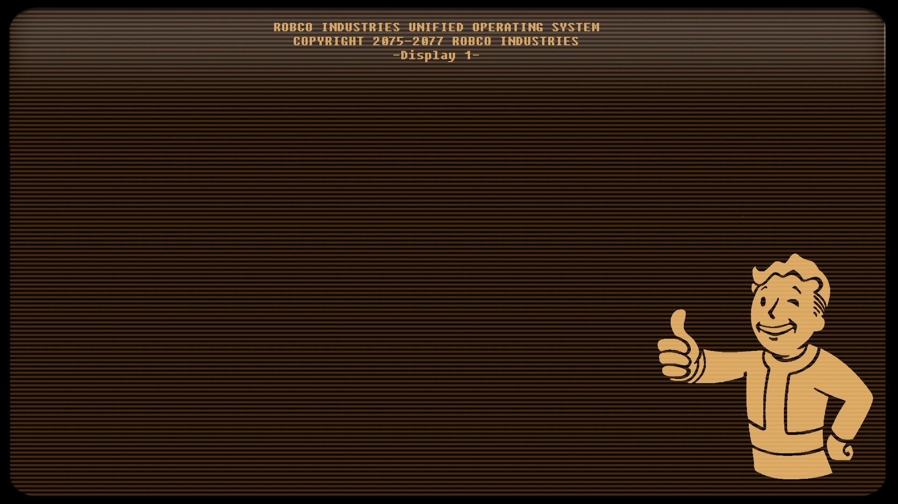

Make sure wget is installed properly!

DEBIAN-BASED
```sh
sudo apt install wget
```

ARCH:
```sh
sudo pacman -S wget
```



INSTALLING GRUB THEME:
```sh
wget -O - https://github.com/MinimumADHD/robco-grub-theme-fidelty/raw/master/install.sh | sh
```